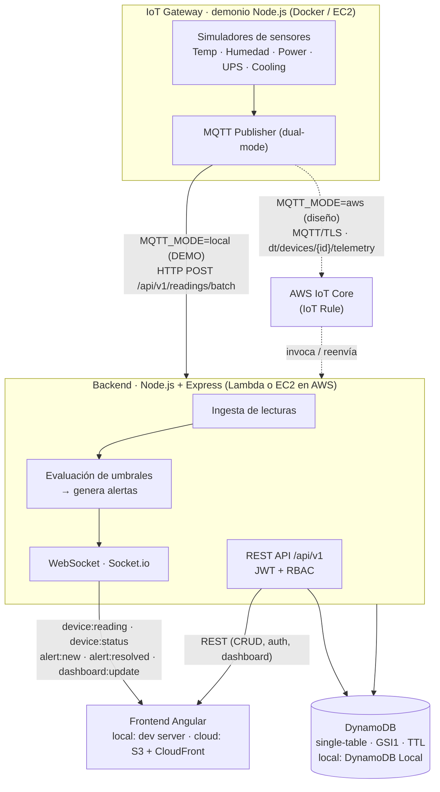
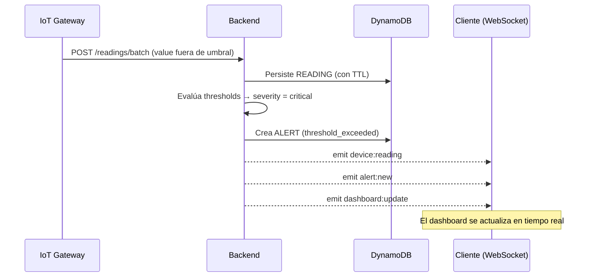
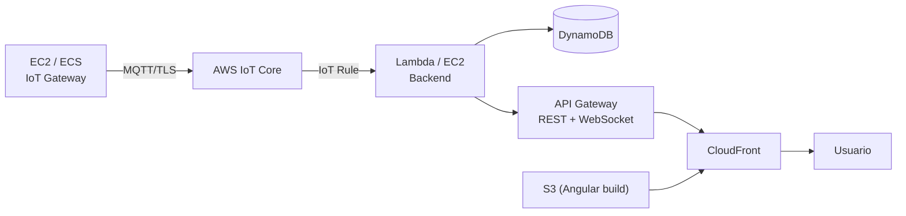

# Diagrama de Arquitectura — Salinas IoT Platform

> Los diagramas están en **Mermaid**, que GitHub renderiza automáticamente.
> Para exportar a imagen: pega el código en <https://mermaid.live> y descarga PNG/SVG.

## 1. Vista general (flujo de telemetría dual-mode)



## 2. Modelo de datos (single-table design)

```mermaid
erDiagram
    DEVICE {
        string PK "DEVICE#<id>"
        string SK "METADATA"
        string type "temperature|humidity|power|ups|cooling"
        string status "online|offline|maintenance|critical"
        object thresholds "min/max/criticalMin/criticalMax"
    }
    READING {
        string PK "DEVICE#<id>"
        string SK "READING#<timestamp>#<uuid>"
        number value
        string quality "good|uncertain|bad"
        number TTL "epoch + 30 días"
    }
    ALERT {
        string PK "ALERT#<id>"
        string SK "METADATA"
        string GSI1PK "DEVICE#<id>"
        string severity "info|warning|critical|emergency"
        boolean acknowledged
    }
    USER {
        string PK "USER#<id>"
        string SK "METADATA"
        string GSI1PK "EMAIL#<email>"
        string role "admin|operator|viewer"
    }
    REFRESH_TOKEN {
        string PK "USER#<id>"
        string SK "REFRESH#<tokenId>"
        number TTL "epoch + 7 días"
    }

    DEVICE ||--o{ READING : "tiene"
    DEVICE ||--o{ ALERT : "genera (vía GSI1)"
    USER ||--o{ REFRESH_TOKEN : "posee"
```

- **Una sola tabla** (`IoTData`) para todas las entidades.
- **GSI1** (`GSI1PK` + `SK`) → busca usuarios por email y alertas por dispositivo.
- **TTL** → borra automáticamente lecturas (30 d) y refresh tokens (7 d).

## 3. Flujo de una lectura anómala (end-to-end)



## 4. Despliegue objetivo en AWS


